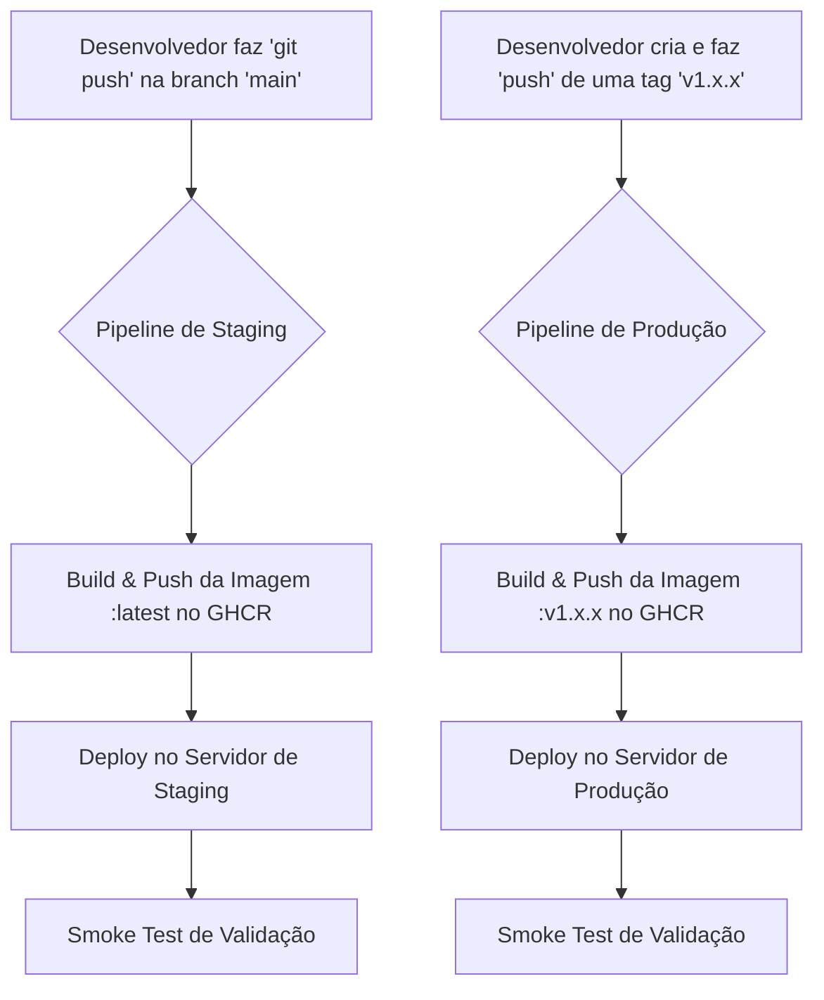

# Desafio Técnico – DevOps na Lacrei Saúde

Repositório contendo a solução para o desafio técnico de DevOps da Lacrei Saúde. Este projeto implementa pipelines de CI/CD para o deploy automatizado de uma aplicação Node.js em ambientes de **Staging** e **Produção** na AWS, utilizando as melhores práticas de segurança, observabilidade e automação.

> 📄 **Nota do Desenvolvedor:** Para um passo a passo detalhado de toda a jornada de construção deste projeto, incluindo cada comando, desafio e decisão técnica, por favor, veja o documento **[Jornada do Projeto](JORNADA_DO_PROJETO.md)**.

---

## 🔗 Links Rápidos e Ambientes

- **Ambiente de Staging:** [https://saulo-devops-lacrei.duckdns.org/status](https://saulo-devops-lacrei.duckdns.org/status)
- **Ambiente de Produção:** [https://saulo-prod-lacrei.duckdns.org/status](https://saulo-prod-lacrei.duckdns.org/status)

## 🚀 Tecnologias Utilizadas

- **Aplicação:** Node.js com Express.js
- **Containerização:** Docker
- **Cloud:** AWS (EC2, IAM, CloudWatch, SNS)
- **Registro de Contêiner:** GitHub Container Registry (GHCR)
- **CI/CD:** GitHub Actions
- **Controle de Versão:** Git & GitHub

---

## ⚙️ 1. Setup dos Ambientes (Staging e Produção)

Foram configurados dois ambientes independentes na AWS utilizando o serviço EC2 para garantir o isolamento entre testes e produção.

As especificações para **ambas** as instâncias (`lacrei-staging-server` e `lacrei-production-server`) são:

- **Provedor Cloud:** AWS
- **Região:** `us-east-1` (Norte da Virgínia)
- **Serviço:** EC2 (Elastic Compute Cloud)
- **AMI (Sistema Operacional):** Ubuntu Server 22.04 LTS
- **Tipo de Instância:** `t2.micro` (Qualificada para o Nível Gratuito)
- **Chave de Acesso:** `lacrei-devops-key.pem` foi gerada e é reutilizada para acesso seguro via SSH a ambos os servidores.
- **Security Group (Firewall):** Um único grupo de segurança (`lacrei-webserver-sg`) é aplicado a ambas as instâncias, com regras para permitir tráfego nas portas:
  - **Porta 22 (SSH):** Para acesso administrativo remoto.
  - **Porta 80 (HTTP):** Para o redirecionamento automático para HTTPS.
  - **Porta 443 (HTTPS):** **Ativa**, com certificados SSL/TLS da Let's Encrypt para garantir a comunicação criptografada.

---

## 🔄 2. Fluxo de CI/CD

O projeto utiliza dois pipelines de CI/CD distintos com **GitHub Actions**, um para cada ambiente. A grande melhoria implementada foi a migração do Docker Hub para o **GitHub Container Registry (GHCR)**, tornando a autenticação mais simples e segura.

#### Diagrama do Fluxo de Deploy

### Pipeline de Staging (`deploy-staging.yml`)
1.  **Gatilho (Trigger):** Acionado automaticamente a cada `push` na branch `main`.
2.  **Autenticação:** O pipeline faz login no GHCR usando um `GITHUB_TOKEN` automático e seguro.
3.  **Build & Push:** A imagem Docker é construída e enviada para o GHCR com a tag `latest`.
4.  **Deploy:** O pipeline conecta-se ao servidor de **staging** via SSH e executa um script que baixa a nova imagem e reinicia o contêiner com as configurações de HTTPS e logging.
5.  **Validação (Smoke Test):** Um teste final é executado com `curl -f` para validar que a aplicação está no ar e respondendo corretamente.

### Pipeline de Produção (`deploy-production.yml`)
1.  **Gatilho (Trigger):** Acionado **manualmente** através da criação de uma `tag` de versão no Git (ex: `v1.0.0`).
2.  **Autenticação:** O processo é idêntico ao de staging.
3.  **Build & Push:** A imagem Docker é construída e enviada para o GHCR com uma tag de versão explícita, baseada na tag do Git.
4.  **Deploy:** O pipeline conecta-se ao servidor de **produção** e executa o mesmo processo de deploy.
5.  **Validação (Smoke Test):** Um teste similar valida o sucesso da implantação.

---

## ⚠️ 3. Registro de Erros e Decisões Tomadas

Durante o projeto, diversos desafios foram encontrados. A documentação a seguir detalha os problemas e as soluções aplicadas.

#### 1. Política de Execução do PowerShell
- **Problema:** O PowerShell bloqueou a execução de scripts `npm`.
- **Solução:** A política de execução foi alterada para `RemoteSigned` com privilégios de administrador.

#### 2. `node_modules` no Controle de Versão
- **Problema:** A pasta `node_modules` foi acidentalmente adicionada à área de preparação do Git.
- **Solução:** Foi criado um `.gitignore` e o cache do Git foi limpo com `git rm -rf --cached .`.

#### 3. Permissões da Chave SSH no Windows
- **Problema:** O cliente SSH retornou erros de "permissões muito abertas" (`UNPROTECTED PRIVATE KEY FILE!`).
- **Solução:** As permissões do arquivo `.pem` no Windows foram ajustadas para permitir acesso apenas ao usuário proprietário.

#### 4. Erro de Conexão no Deploy (`i/o timeout`)
- **Problema:** O pipeline começou a falhar na etapa de deploy via SSH após a criação de um IP Fixo (Elástico).
- **Solução:** O segredo `AWS_HOST` no GitHub foi atualizado com o novo IP Fixo.

#### 5. Erro Persistente de Autenticação no Docker Hub (`insufficient_scope`)
- **Problema:** O pipeline de produção falhava consistentemente ao tentar enviar a imagem para o Docker Hub, mesmo com um token de acesso com permissões corretas.
- **Decisão Estratégica:** Após esgotar as tentativas de debug, foi tomada a decisão de **migrar do Docker Hub para o GitHub Container Registry (GHCR)**. Esta solução se provou mais robusta, segura e integrada, resolvendo o problema de autenticação definitivamente ao usar o `GITHUB_TOKEN` nativo.

---

## ⏪ 4. Processo de Rollback

A estratégia de rollback utiliza a funcionalidade nativa do GitHub Actions para reverter uma versão.

#### Passos para o Rollback Manual:
1.  **Identificar o Deploy Estável:** Na aba **`Actions`**, encontrar a execução do workflow bem-sucedida que corresponde à versão estável (ex: a da tag `v1.0.12`).
2.  **Re-executar o Workflow:** Clicar nesta execução para ver seus detalhes. No canto superior direito da tela, clicar no botão **`Re-run all jobs`**.
3.  **Resultado:** O GitHub Actions iniciará uma nova execução, usando o mesmo código-fonte (commit) daquela versão anterior. O pipeline irá reconstruir a imagem, enviá-la ao **GHCR** com a tag de versão correspondente, e implantá-la no servidor, substituindo a versão com bug.

#### Proposta de Futura Melhoria (Rollback Avançado)
Como agora o pipeline de produção já cria tags de imagem versionadas no GHCR (ex: `ghcr.io/saulocdemonte/desafio-lacrei-app:v1.0.12`), a estratégia de rollback pode ser ainda mais rápida. O processo seria:
1. Conectar-se ao servidor EC2 via SSH.
2. Parar e remover o contêiner atual.
3. Iniciar um novo contêiner apontando diretamente para a tag da versão estável anterior, sem a necessidade de um novo build.

---

## 🛡️ 5. Checklist de Segurança Aplicado

- **Gerenciamento de Segredos:** Todas as credenciais sensíveis (chaves da AWS) são gerenciadas de forma segura com **GitHub Secrets**. A autenticação com o GHCR utiliza o `GITHUB_TOKEN` automático, eliminando a necessidade de gerenciar tokens de serviços terceiros.
- **Firewall de Rede (AWS Security Group):** As instâncias EC2 estão protegidas por um firewall que permite tráfego apenas nas portas `22` (SSH), `80` (HTTP) e `443` (HTTPS), seguindo o princípio do menor privilégio.
- **Autenticação Segura ao Servidor:** O acesso é feito exclusivamente por chaves criptográficas (SSH Key Pair), em vez de senhas.
- **Conexão Criptografada (HTTPS/TLS):** A comunicação com a aplicação é **criptografada com certificados SSL/TLS** da Let's Encrypt em ambos os ambientes, garantindo a confidencialidade dos dados em trânsito.
- **Permissões Mínimas na Nuvem (IAM):** Foi criada uma **IAM Role** (`EC2-CloudWatch-Logs-Role`) específica para a tarefa de logging. A instância EC2 assume essa role, garantindo que ela tenha permissão **apenas** para interagir com o CloudWatch, sem acesso desnecessário a outros serviços da AWS.

---

## 👁️ 6. Observabilidade e Alertas

### Logging Centralizado com CloudWatch
Os logs da aplicação são transmitidos em tempo real para o **AWS CloudWatch Logs**, garantindo persistência e acesso centralizado para análise e debug. Isso foi configurado via driver `awslogs` do Docker, com permissões gerenciadas por uma IAM Role específica.

### Monitoramento e Alertas Proativos (Bônus)
Foi implementado um sistema de alertas com **AWS CloudWatch Alarms** e **AWS SNS**. Um alarme monitora o uso de CPU da instância e envia uma notificação por email caso ultrapasse 70% por 5 minutos, permitindo uma ação rápida antes que os usuários sejam impactados.

---

## 💰 7. Bônus: Proposta de Integração com Asaas

Esta seção descreve a arquitetura proposta para integrar a aplicação com o sistema de pagamentos Asaas, incluindo a criação de cobranças via API e a confirmação via Webhooks. A chave de API seria gerenciada de forma segura via GitHub Secrets.

---

## 🧹 8. Procedimento de Limpeza (Cleanup)

Para garantir a otimização de custos após o período de avaliação deste desafio, um procedimento detalhado de remoção de todos os recursos da AWS foi documentado. As instruções passo a passo se encontram na etapa final do documento **[Jornada do Projeto](JORNADA_DO_PROJETO.md)**.

